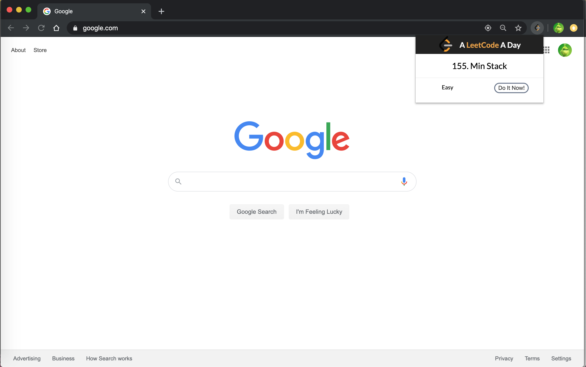

# A-LeetCode-A-Day
Chrome extension to pop up a random LeetCode top 100 questions.

## Example

## Installation
### Clone
- Clone this repo to your local machine using `https://github.com/vanessaaleung/A-LeetCode-A-Day.git`

### Setup
- Open the Extension Management page by navigating to chrome://extensions.
- The Extension Management page can also be opened by clicking on the Chrome menu, hovering over More Tools then selecting Extensions.
- Enable Developer Mode by clicking the toggle switch next to Developer mode.
Click the LOAD UNPACKED button and select the extension directory.

## Features

## License

- **[MIT license](http://opensource.org/licenses/mit-license.php)**
