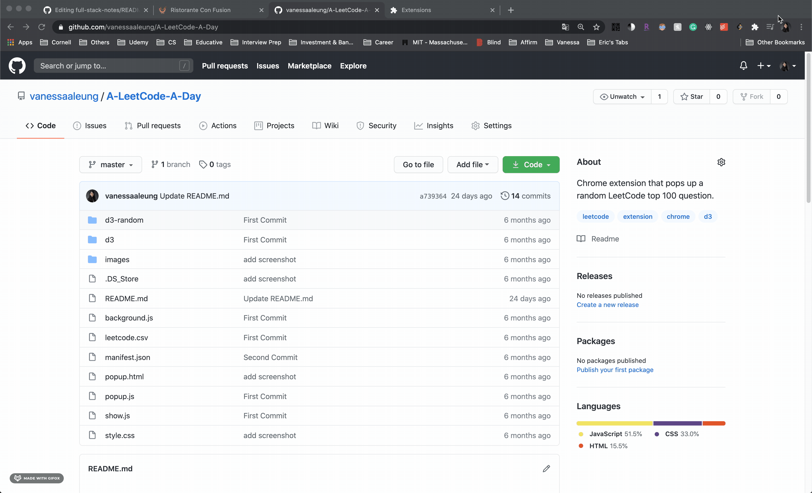

# A-LeetCode-A-Day
Chrome extension that pops up a random LeetCode top 100 question.

## Features

1. Display a random top 100 question and its difficulty
2. Link to the question

## Installation
### Clone
- Clone this repo to your local machine using `https://github.com/vanessaaleung/A-LeetCode-A-Day.git`

### Setup
- Open the Extension Management page by navigating to chrome://extensions.
- The Extension Management page can also be opened by clicking on the Chrome menu, hovering over **More Tools** then selecting **Extensions**.
- Enable Developer Mode by clicking the toggle switch next to **Developer mode**.
- Click the **LOAD UNPACKED** button and select the extension directory.

## Features
- Click on the icon on the bar will pop up a random questions
- Click on the Do It Now! button will open a window for that question

## License

- **[MIT license](http://opensource.org/licenses/mit-license.php)**
